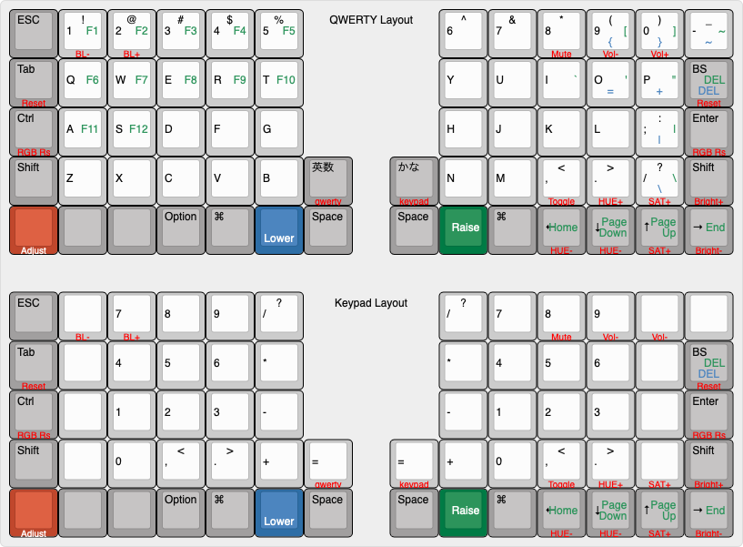

# The Moperon Helix Layout
## Layout



### Qwerty

```
,-----------------------------------------.             ,-----------------------------------------.
| ESC  |   1  |   2  |   3  |   4  |   5  |             |   6  |   7  |   8  |   9  |   0  | -_   |
|------+------+------+------+------+------|             |------+------+------+------+------+------|
| Tab  |   Q  |   W  |   E  |   R  |   T  |             |   Y  |   U  |   I  |   O  |   P  | Bksp |
|------+------+------+------+------+------|             |------+------+------+------+------+------|
| Ctrl |   A  |   S  |   D  |   F  |   G  |             |   H  |   J  |   K  |   L  |  ;:  |Enter |
|------+------+------+------+------+------+------+------+------+------+------+------+------+------|
| Shift|   Z  |   X  |   C  |   V  |   B  | Eisu | Kana |   N  |   M  |  ,<  |  .>  |  /?  |Shift |
|------+------+------+------+------+------+------+------+------+------+------+------+------+------|
|Adjust|      |      |Option|  CMD |Lower |Space |Space |Raise |  CMD | Left | Down |  Up  |Right |
`-------------------------------------------------------------------------------------------------'
```

### Keypad
```
,-----------------------------------------.             ,-----------------------------------------.
| ESC  |      |      |      |      |      |             |      | ESC  |      |  %   |  /   |      |
|------+------+------+------+------+------|             |------+------+------+------+------+------|
| Tab  |      |  Up  |      |      |      |             |      |  7   |  8   |  9   |  *   | Bksp |
|------+------+------+------+------+------|             |------+------+------+------+------+------|
| Ctrl | Left | Down | Right|      |      |             |      |  4   |  5   |  6   |  -   |Enter |
|------+------+------+------+------+------+------+------+------+------+------+------+------+------|
| Shift|      |      |      |      |      |      |      |      |  1   |  2   |  3   |  +   |Shift |
|------+------+------+------+------+------+------+------+------+------+------+------+------+------|
|Adjust|      |      |Option|  CMD |      |Space |Space |      |  0   |  ,   |  .   |  =   |      |
`-------------------------------------------------------------------------------------------------'
```

## Layers

|Priority|number|name|description|
| ---- | ---- | --- | --- |
|high|16|Adjust|Functions|
||3|Raise|Function keys and charactors|
||2|Lower|Other charactors|
||1|Keypad|Keypad leyout|
|low|0|Qwerty|QWERTY leyout(base)|

### Lower
```
,-----------------------------------------.             ,-----------------------------------------.
| ESC  |  !   |  @   |  #   |  $   |  %   |             |  ^   |  &   |  *   |  (   |  )   |  -   |
|------+------+------+------+------+------|             |------+------+------+------+------+------|
| Tab  |  F1  |  F2  |  F3  |  F4  |  F5  |             |      |  =   |  [   |  ]   |  \   | Del  |
|------+------+------+------+------+------|             |------+------+------+------+------+------|
| Ctrl |  F6  |  F7  |  F8  |  F9  |  F10 |             |      |      |  `   |  '   |  ;   | Enter|
|------+------+------+------+------+------+------+------+------+------+------+------+------+------|
| Shift|  F11 |  F12 |      |      |      |      |      |      |      |  ,   |  .   |  /   | Shift|
|------+------+------+------+------+------+------+------+------+------+------+------+------+------|
|Adjust|      |      |Option|  CMD |Lower |Space |Space |Raise |  CMD | Home |PgDown| PgUp | End  |
`-------------------------------------------------------------------------------------------------'
```

### Raise
```
,-----------------------------------------.             ,-----------------------------------------.
| ESC  |  !   |  @   |  #   |  $   |  %   |             |  ^   |  &   |  *   |  (   |  )   |  _   |
|------+------+------+------+------+------|             |------+------+------+------+------+------|
| Tab  |  F1  |  F2  |  F3  |  F4  |  F5  |             |      |  +   |  {   |  }   |  |   | Del  |
|------+------+------+------+------+------|             |------+------+------+------+------+------|
| Ctrl |  F6  |  F7  |  F8  |  F9  |  F10 |             |      |      |  ~   |  "   |  :   | Enter|
|------+------+------+------+------+------+------+------+------+------+------+------+------+------|
| Shift|  F11 |  F12 |      |      |      |      |      |      |      |  <   |  >   |  ?   | Shift|
|------+------+------+------+------+------+------+------+------+------+------+------+------+------|
|Adjust|      |      |Option|  CMD |Lower |Space |Space |Raise |  CMD | Home |PgDown| PgUp | End  |
`-------------------------------------------------------------------------------------------------'
```

### Adjust (Lower + Raise)
```
,-----------------------------------------.             ,-----------------------------------------.
|      |BrtDwn|BrtUp |      |      |      |             |      |      | Mute |VolDwn| VolUp|      |
|------+------+------+------+------+------|             |------+------+------+------+------+------|
|Reset |      |      |      |      |      |             |      |      |      |      |      |Reset |
|------+------+------+------+------+------|             |------+------+------+------+------+------|
|RGBRst|      |      |      |      |      |             |      |      |      |      |      |RGBRst|
|------+------+------+------+------+------+------+------+------+------+------+------+------+------|
|      |      |      |      |      |      |QWERTY|KEYPAD|      |      |RGB ON| HUE+ | SAT+ | VAL+ |
|------+------+------+------+------+------+------+------+------+------+------+------+------+------|
|      |      |      |      |      |      |      |      |      |      | MODE | HUE- | SAT- | VAL- |
`-------------------------------------------------------------------------------------------------'
```

## Customize

see `qmk_firmware/keyboards/helix/rev2/keymaps/moperon/rules.mk`

```
# Helix keyboard customize
# you can edit follows 7 Variables
#  jp: 以下の7つの変数を必要に応じて編集します。
HELIX_ROWS = 5              # Moperon layout does not support 4 rows
OLED_ENABLE = no            # OLED_ENABLE
LOCAL_GLCDFONT = no         # use each keymaps "helixfont.h" insted of "common/glcdfont.c"
LED_BACK_ENABLE = no        # LED backlight (Enable WS2812 RGB underlight.)
LED_UNDERGLOW_ENABLE = no   # LED underglow (Enable WS2812 RGB underlight.)
LED_ANIMATIONS = yes        # LED animations
IOS_DEVICE_ENABLE = no      # connect to IOS device (iPad,iPhone)

```
## Compile

go to qmk top directory.
```
$ cd qmk_firmware
```

build
```
$ make helix:moperon
```

flash to keyboard
```
$ make helix:moperon:avrdude
```

## Link
* more detail wrote in Japanese [helix/Doc/firmware_jp.md](https://github.com/MakotoKurauchi/helix/blob/master/Doc/firmware_jp.md)
* [Helix top](https://github.com/MakotoKurauchi/helix)
