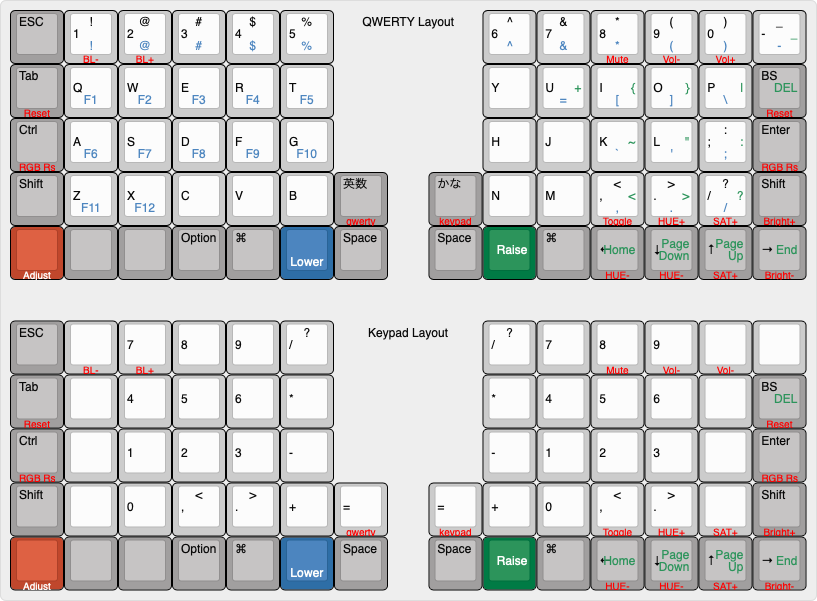

# The Moperon Helix Layout
## 配列

Mac向けのレイアウトで5行配列に対応しています。
記号類は右側に集中させ、Qwertyレイヤに現れない記号は全てアルファベットキーのLower/Raiseに割り当てました。
アルファベットキーに割り当てられた記号のうち、RaiseレイヤのものはLower + Shiftと一致します。

Adjustの右の2つのキーは余りで、キーコードが割り当てられていません。



### Qwerty

```
,-----------------------------------------.             ,-----------------------------------------.
| ESC  |   1  |   2  |   3  |   4  |   5  |             |   6  |   7  |   8  |   9  |   0  | -_   |
|------+------+------+------+------+------|             |------+------+------+------+------+------|
| Tab  |   Q  |   W  |   E  |   R  |   T  |             |   Y  |   U  |   I  |   O  |   P  | Bksp |
|------+------+------+------+------+------|             |------+------+------+------+------+------|
| Ctrl |   A  |   S  |   D  |   F  |   G  |             |   H  |   J  |   K  |   L  |  ;:  |Enter |
|------+------+------+------+------+------+------+------+------+------+------+------+------+------|
| Shift|   Z  |   X  |   C  |   V  |   B  | Eisu | Kana |   N  |   M  |  ,<  |  .>  |  /?  |Shift |
|------+------+------+------+------+------+------+------+------+------+------+------+------+------|
|Adjust|      |      |Option|  CMD |Lower |Space |Space |Raise |  CMD | Left | Down |  Up  |Right |
`-------------------------------------------------------------------------------------------------'
```

### Keypad

```
,-----------------------------------------.             ,-----------------------------------------.
| ESC  |      |      |      |      |      |             |      | ESC  |      |  %   |  /   |      |
|------+------+------+------+------+------|             |------+------+------+------+------+------|
| Tab  |      |  Up  |      |      |      |             |      |  7   |  8   |  9   |  *   | Bksp |
|------+------+------+------+------+------|             |------+------+------+------+------+------|
| Ctrl | Left | Down | Right|      |      |             |      |  4   |  5   |  6   |  -   |Enter |
|------+------+------+------+------+------+------+------+------+------+------+------+------+------|
| Shift|      |      |      |      |      |      |      |      |  1   |  2   |  3   |  +   |Shift |
|------+------+------+------+------+------+------+------+------+------+------+------+------+------|
|Adjust|      |      |Option|  CMD |      |Space |Space |      |  0   |  ,   |  .   |  =   |      |
`-------------------------------------------------------------------------------------------------'
```

## Layers

|Priority|number|name|description|
| ---- | ---- | --- | --- |
|high|16|Adjust|Functions|
||3|Raise|Function keys and shifted charactors|
||2|Lower|Function keys and charactors|
||1|Keypad|Keypad leyout|
|low|0|Qwerty|QWERTY leyout(base)|

### Lower
```
,-----------------------------------------.             ,-----------------------------------------.
| ESC  |  !   |  @   |  #   |  $   |  %   |             |  ^   |  &   |  *   |  (   |  )   |  -   |
|------+------+------+------+------+------|             |------+------+------+------+------+------|
| Tab  |  F1  |  F2  |  F3  |  F4  |  F5  |             |      |  =   |  [   |  ]   |  \   | Del  |
|------+------+------+------+------+------|             |------+------+------+------+------+------|
| Ctrl |  F6  |  F7  |  F8  |  F9  |  F10 |             |      |      |  `   |  '   |  ;   | Enter|
|------+------+------+------+------+------+------+------+------+------+------+------+------+------|
| Shift|  F11 |  F12 |      |      |      |      |      |      |      |  ,   |  .   |  /   | Shift|
|------+------+------+------+------+------+------+------+------+------+------+------+------+------|
|Adjust|      |      |Option|  CMD |Lower |Space |Space |Raise |  CMD | Home |PgDown| PgUp | End  |
`-------------------------------------------------------------------------------------------------'
```

### Raise
```
,-----------------------------------------.             ,-----------------------------------------.
| ESC  |  !   |  @   |  #   |  $   |  %   |             |  ^   |  &   |  *   |  (   |  )   |  _   |
|------+------+------+------+------+------|             |------+------+------+------+------+------|
| Tab  |  F1  |  F2  |  F3  |  F4  |  F5  |             |      |  +   |  {   |  }   |  |   | Del  |
|------+------+------+------+------+------|             |------+------+------+------+------+------|
| Ctrl |  F6  |  F7  |  F8  |  F9  |  F10 |             |      |      |  ~   |  "   |  :   | Enter|
|------+------+------+------+------+------+------+------+------+------+------+------+------+------|
| Shift|  F11 |  F12 |      |      |      |      |      |      |      |  <   |  >   |  ?   | Shift|
|------+------+------+------+------+------+------+------+------+------+------+------+------+------|
|Adjust|      |      |Option|  CMD |Lower |Space |Space |Raise |  CMD | Home |PgDown| PgUp | End  |
`-------------------------------------------------------------------------------------------------'
```

### Adjust (Lower + Raise)
```
,-----------------------------------------.             ,-----------------------------------------.
|      |BrtDwn|BrtUp |      |      |      |             |      |      | Mute |VolDwn| VolUp|      |
|------+------+------+------+------+------|             |------+------+------+------+------+------|
|Reset |      |      |      |      |      |             |      |      |      |      |      |Reset |
|------+------+------+------+------+------|             |------+------+------+------+------+------|
|RGBRst|      |      |      |      |      |             |      |      |      |      |      |RGBRst|
|------+------+------+------+------+------+------+------+------+------+------+------+------+------|
|      |      |      |      |      |      |QWERTY|KEYPAD|      |      |RGB ON| HUE+ | SAT+ | VAL+ |
|------+------+------+------+------+------+------+------+------+------+------+------+------+------|
|      |      |      |      |      |      |      |      |      |      | MODE | HUE- | SAT- | VAL- |
`-------------------------------------------------------------------------------------------------'
```

## コンパイルの仕方

コンパイルは、qmk_firmware のトップディレクトリで行います。

```
$ cd qmk_firmware
```
qmk_firmwareでは各キーボードのコンパイルは、`<キーボード名>:<キーマップ名>`という指定で行います。

```
$ make helix:moperon
```

キーボードへの書き込みまで同時に行うには下記のように`:avrdude`を付けます。

```
$ make helix:moperon:avrdude
```

コンパイル結果と中間生成物を消去したい場合は以下のようにします。

```
$ make helix:moperon:clean
```

## カスタマイズ

オプションの OLED をつけたり、RGB バックライトまたは、RGB Underglow をつけた場合は、
`qmk_firmware/keyboards/helix/rev2/keymaps/moperon/rules.mk` の以下の部分を編集して機能を有効化してください。

Moperon Layoutは4行版には対応していません。

```
# Helix keyboard customize
# you can edit follows 7 Variables
#  jp: 以下の7つの変数を必要に応じて編集します。
HELIX_ROWS = 5              # Moperon layout does not support 4 rows
OLED_ENABLE = no            # OLED_ENABLE
LOCAL_GLCDFONT = no         # use each keymaps "helixfont.h" insted of "common/glcdfont.c"
LED_BACK_ENABLE = no        # LED backlight (Enable WS2812 RGB underlight.)
LED_UNDERGLOW_ENABLE = no   # LED underglow (Enable WS2812 RGB underlight.)
LED_ANIMATIONS = yes        # LED animations
IOS_DEVICE_ENABLE = no      # connect to IOS device (iPad,iPhone)

```

## RGB バックライトを有効にする

rules.mk の下記の部分を編集して no を yes に変更してください。

```
LED_BACK_ENABLE = yes        # LED backlight (Enable WS2812 RGB underlight.)
```

## RGB Underglow を有効にする

rules.mk の下記の部分を編集して no を yes に変更してください。
```
LED_UNDERGLOW_ENABLE = yes   # LED underglow (Enable WS2812 RGB underlight.)
```

## OLEDを有効にする

rules.mk の下記の部分を編集して no を yes に変更してください。
```
OLED_ENABLE = yes            # OLED_ENABLE
```

## iPad/iPhoneサポートを有効にする。

rules.mk の下記の部分を編集して no を yes に変更してください。
RBG Underglow や RGBバックライトの輝度を抑えて、iPad, iPhone にも接続できるようになります。

```
IOS_DEVICE_ENABLE = no      # connect to IOS device (iPad,iPhone)
```

## リンク

* さらに詳細は、[こちら helix/Doc/firmware_jp.md](https://github.com/MakotoKurauchi/helix/blob/master/Doc/firmware_jp.md)をご覧ください。
* [Helix top](https://github.com/MakotoKurauchi/helix)
